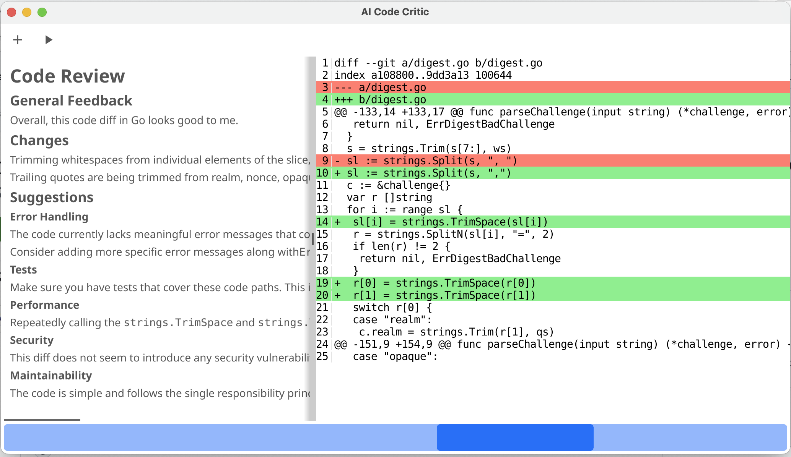

# AI-Code-Critic 🚀


## Overview 🌟

AI-Code-Critic is a desktop application designed to automate code reviews
across various programming languages, utilizing OpenAI's ChatGPT API.
It offers intelligent insights and suggestions to improve code quality
and developer efficiency.

## Features 🛠️

- **Language-Agnostic Analysis**: Compatible with multiple programming
languages.
- **AI-Powered Insights**: Employs ChatGPT for in-depth code analysis.
- **User-Friendly Interface**: Simple and intuitive GUI for effortless
usage, built with Fyne.

## Installation 🔧

To install AI-Code-Critic, you need to have Go installed on your machine.
Follow these steps:

```bash
go install github.com/kmesiab/ai-code-critic@latest
```

To run the program:

```bash
./ai-code-critic
```

## Usage 💡



1. Click the "+" button and enter the url to a github pull request.
2. Wait patiently while things happen.
3. The diff will be loaded in the right pane.
4. The report will appear shortly after in the left pane.

## Development and Testing 🧪

### Building the Project 🏗️

```bash
make build
```

### Running Tests ✔️

```bash
make test
make test-verbose
make test-race
```

### Installing Tools 🛠️

```bash
make install-tools
```

### Linting 🧹

```bash
make lint
make lint-markdown
```

## Contributing 🤝

### Forking and Sending a Pull Request

1. **Fork the Repository**: Click the 'Fork' button at the top right of this
page.
2. **Clone Your Fork**:

   ```bash
   git clone https://github.com/kmesiab/ai-code-critic
   cd ai-code-critic
   ```

3. **Create a New Branch**:

   ```bash
   git checkout -b your-branch-name
   ```

4. **Make Your Changes**: Implement your changes or fix issues.
5. **Commit and Push**:

   ```bash
   git commit -m "Add your commit message"
   git push origin your-branch-name
   ```

6. **Create a Pull Request**: Go to your fork on GitHub and click the
'Compare & pull request' button.

## Github Guidelines

Please ensure your code adheres to the project's
[standards and guidelines](https://github.com/kmesiab/ai-code-critic/discussions/24).

### Quick Tips

Run `make lint` before committing to ensure your code is properly formatted.

1. **Always rebase, never merge commit**
2. Always use a description commit message
3. Separate your title from your description
4. Keep commit messages under 50 characters
5. Start your branch with `feat|bugfix|docs|style|refactor|perf|test`
6. Squash your commits into logical units of work

## License 📝

Information regarding the licensing of AI-Code-Critic will be included here.

---

*Note: This project is under active development. Additional features
and documentation will be updated in due course.* 🌈
